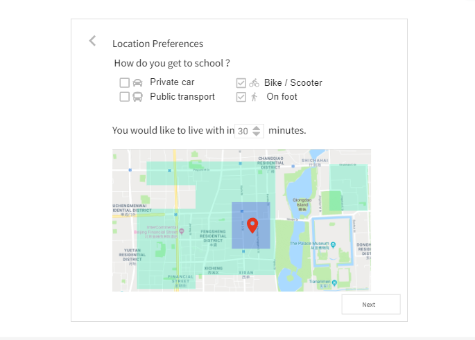

# UrHome
Web application to improve the experience of finding rental houses

## 产品原型核心功能实现：
- 根据交通工具和时间得到地图上地理位置范围
- 标记处地图上的公共设施位置：健身房，超市，咖啡厅，餐馆
- 可以用颜色标出犯罪率和房价的分布

## 需要解决的问题：
- 如何区分neighborhood
- 如何在地图上添加颜色
- 如何获取犯罪率和房价的数据
- 设置交通工具和时间，得到地图上的范围
- 如何在地图上显示小图标

## 参考网站
- 地图上加颜色分块：https://www.neighborhoodscout.com/md/baltimore/crime
- https://drive.google.com/open?id=1X47zMramwnVvuzsEWOmhRpdyMYM

## 技术实现
- React 项目

## 下次会议
周六下午2：00

## 1.项目概述
  很多研究生需要自己在校外租房，对于在外地或是国际学生来说不了解当地情况，学生租房除了会考虑价格、地理位置外，由于学生的出行方式以步行、共享滑板车、公共交通为主活动范围有限，还会考虑交通的便捷性、周边设施等等，另外还会考虑社区的安全性。为了让学生租房更加方便，产品以用户对地理位置偏好为核心，利用地图可视化技术，消除租房信息的不透明，帮助用户更便捷的找到满意的房屋。    

## 2.功能需求  
### 1.问卷页 
  #### 1.1学校页面：  
  
  - University Name搜索框  
  位置：如图  
  交互：用户输入字母后，可以在下方弹出辅助选择栏，模糊搜索  
  - department 搜索栏  
  位置：Univeristy 搜索栏下方  
  交互：用户输入字母后，可以在下方弹出辅助选择栏，模糊搜索  
  极值：如果不填写不影响  
  - Next 按钮  
  位置：问卷右下角  
  交互：点击之后进入下一页  
  
  #### 1.2交通工具和时间倾向：  
     
  - 交通方式勾选栏（也可以直接用mapbox的api，包含了交通方式和时间）  
  位置：问卷上方  
  - 时间  
  - 小地图展示  
  标注地点：地点为学校地址  
  交互：通过交通工具和时间得到范围  
  
  
